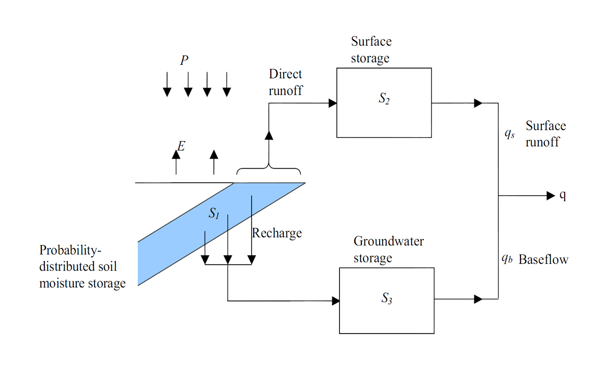

---
title: A Pandoc Markdown Article Starter
author:
- name: Bram De Jaegher
  affiliation: UGent
  email: Bram.DeJaegher@UGent.be
date: January 2014
abstract: Lorem ipsum dolor sit amet, consectetur adipisicing elit, sed do eiusmod tempor incididunt ut labore et dolore magna aliqua. Ut enimad minim veniam, quis nostrud exercitation ullamco laboris nisi ut aliquip ex ea commodo consequat. Duis aute irure dolor in reprehenderit in voluptate velit esse cillum dolore eu fugiat nulla pariatur. Excepteur sint occaecat cupidatat non proident, sunt in culpa qui officia deserunt mollit anim id est laborum.
bibliography: <!-- \bibliography{/Users/kjhealy/Documents/bibs/socbib-pandoc.bib} This is a hack for Emacs users so that RefTeX knows where your bibfile is, and you can use RefTeX citation completion in your .md files. -->
...

# Introduction
Lorem ipsum dolor sit amet, consectetur adipisicing elit, sed do eiusmod tempor incididunt ut labore et dolore magna aliqua [fourcade13classsituat]. Notice that citation there [healy02digittechnculturgoods]. Ut enimad minim veniam, quis nostrud exercitation ullamco laboris nisi ut aliquip ex ea commodo consequat.

# Equations

**Numbered equation with reference,**

 $$\displaystyle {\frac {\partial \mathbf {u} }{\partial t}}+(\mathbf {u} \cdot \nabla )\mathbf {u} -\nu \,\nabla ^{2}\mathbf {u} =-\nabla w+\mathbf {g}.$$ {#eq:NS}

@Eq:NS shows the general flow of this template and also shows how to capitalise references. If for lower case just reference like this @eq:NS.

# Figures
Look at this cool figure

{#fig:exFigure2}

# Tables
Easy tables! Ow yeah....

| This     | is     | a      |
| :------------- | :------------- | :------------- |
| simple       | table     |  |

More complex table conformations are discussed [here](https://pandoc.org/MANUAL.html#tables) and [here](https://rapporter.github.io/pander/pandoc_table.html)

# Citations
Lorem ipsum dolor sit amet, consectetur adipisicing elit, sed do eiusmod tempor incididunt ut labore et dolore magna aliqua [@judd2011]. Notice that citation there [@maxey1983]. Ut enimad minim veniam, quis nostrud exercitation ullamco laboris nisi ut aliquip ex ea commodo consequat.

# Conclusion
Right now, your options for formatting bibliographies using Pandoc are to offload the work to biblatex (or natbib), or have pandoc handle everything via `citeproc` and CSL files. The latter way is simpler and cleaner, especially if we want to preserve the ability to easily generate both HTML and LaTeX/PDF outputs. You have to do two things. First, explicitly specify the "References" header. Second, pandoc does not (yet) support some standard layout options for bibliography entries---it will treat each entry like a regular paragraph, when we want the first lines of each bibliography entry to have no indentation, with subsequent lines (if any) to hang in from the margin. The LaTeX commands below the "References" header accomplish this . The LaTeX commands are ignored when HTML is produced, and do not show up in the output file.

# References
\setlength{\parindent}{-0.2in}
\setlength{\leftskip}{0.2in}
\setlength{\parskip}{8pt}
\vspace*{-0.2in}
\noindent
